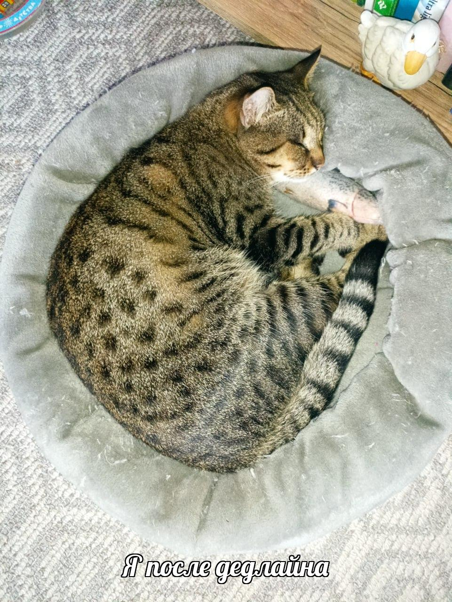

# Telegram Caption Bot 🤖

Telegram-бот, который превращает обычные изображения в мемы.
Пользователь отправляет фото — бот добавляет случайную подпись и возвращает результат.

---

## 🚀 Demo

1. Отправьте изображение боту
2. Получите мем с подписью
3. Получите ссылку на изображение
4. При желании опубликуйте в канал

---

## 📸 Пример



---

## ✨ Возможности

* 📷 Принимает изображения от пользователя
* 🎲 Генерирует случайную подпись из файла
* 🖼 Добавляет текст на изображение (шрифт Lobster)
* ☁️ Загружает изображения в Cloudinary
* 🔗 Отправляет ссылку на готовое изображение
* 📤 Позволяет поделиться в Telegram-канал
* 🐳 Поддерживает запуск через Docker

---

## ⚙️ Настройка

Создайте файл `.env`:

```
BOT_TOKEN=your_token
CHANNEL_ID=-100xxxxxxxxxx
CLOUDINARY_CLOUD_NAME=your_cloud_name
CLOUDINARY_API_KEY=your_api_key
CLOUDINARY_API_SECRET=your_api_secret
```

---

## ▶️ Запуск локально

```
pip install -r requirements.txt
python bot/bot.py
```

---

## 🐳 Docker

```
docker build -t caption-bot .
docker run --env-file .env caption-bot
```

---

## 📁 Структура проекта

```
bot/
  bot.py
  handlers.py
  image_service.py
  cloudinary_service.py
  config.py

captions.txt
example.jpg
requirements.txt
Dockerfile
```

---

## 🛠 Используемые технологии

* Python
* python-telegram-bot
* Pillow
* Cloudinary
* Docker

---

## 📌 Примечания

* Изображения хранятся в облаке (Cloudinary)
* Бот работает через polling (без webhook)
* Для работы требуется Telegram Bot Token и Cloudinary API

---

## 📌 Автор

Irina Tka4eva
